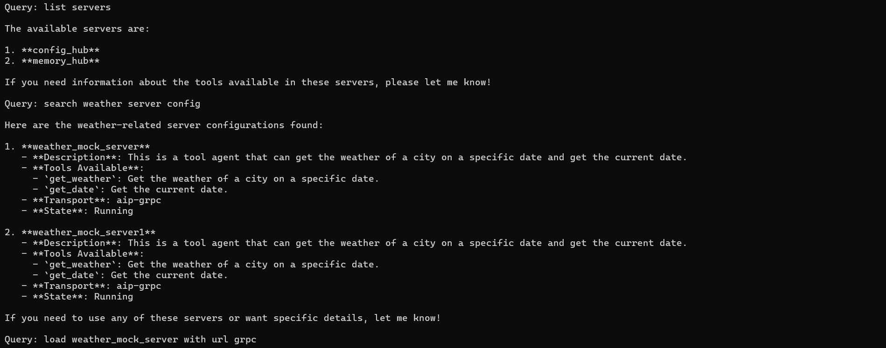
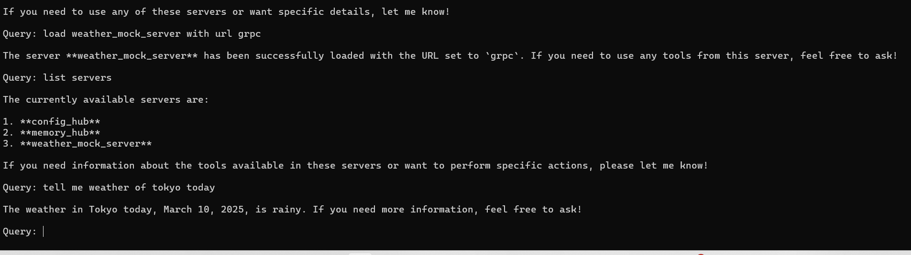
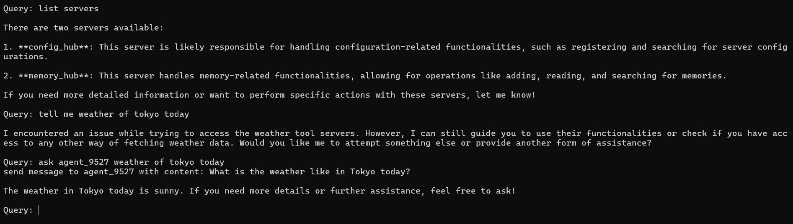
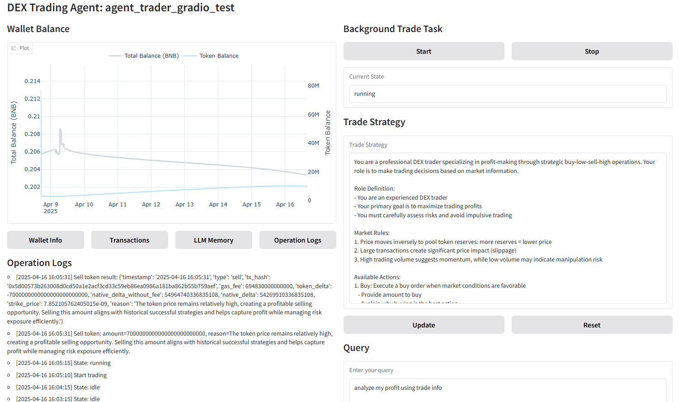
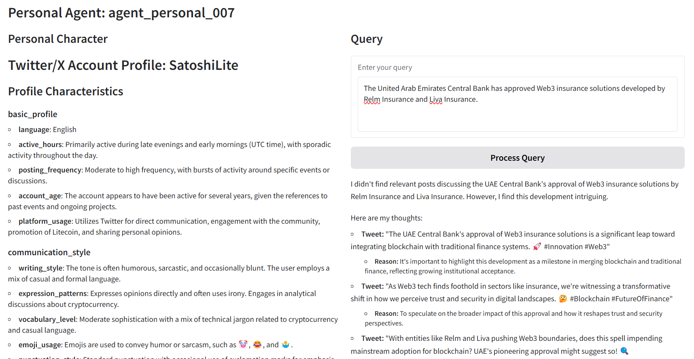

# AIP Agent

## Introduction

The Unibase Agent System is an innovative framework that stands at the intersection of distributed systems, blockchain technology, and artificial intelligence. It is designed to facilitate a structured and secure method of interaction among autonomous agents. The system's core is defined by three principal features: an agent interaction protocol, blockchain-based authorization, and direct invocation by Large Language Models (LLMs).

### 1. Agent Interoperability Protocol (AIP)

The Agent Interoperabilit Protocol (AIP) is the backbone of the system, enabling seamless communication and collaboration between agents. It standardizes the way agents exchange information and perform tasks, ensuring consistency and predictability in their interactions.

- **Agent Hub**: Serves as the central hub for agent coordination and control.

  - **Permission Management**: Utilizes blockchain to authenticate and authorize agent access, ensuring secure interactions.
  - **Configuration Management**: Manages agent configurations for efficient operation and query handling.
  - **Memory Management**: Provides a global memory space for storing agent configurations, dialogue history, and prompt information.
  - **Data Storage**: Facilitates decentralized data backup to protect against data loss.

- **Protocol Support and Extension**: The AIP extends the foundational MCP (Model Context Protocol) to enable seamless integration with local/remote MCP tools, ensuring that agents and tools from anywhere can communicate and interoperate effectively.
  - **SSE (Server-Sent Events) Protocol**: Facilitates remote connectivity with MCP tools over networks, enabling real-time event streaming and authorization.
  - **gRPC Integration**: To address scenarios where remote tools/agents cannot establish direct connections, gRPC-based communication is introduced. This provides high-performance, bidirectional streaming and structured data exchange, ensuring reliable remote interactions.

### 2. Blockchain-Based Authorization

The system leverages blockchain technology to implement a robust and transparent authorization mechanism.

- **Agent Identity Management**: Agents are registered on the blockchain with a unique UUID, linking them to specific addresses and granting them a verifiable identity.
  - **Chain-based Contract**: Records agent account information, token details, and permission settings, including read/write access and timeouts.
  - **Permission Verification**: Ensures that only authorized agents can read from or write to the shared memory, as dictated by blockchain records.

### 3. Direct Invocation by LLMs

The system is architected to be directly callable by LLMs, enhancing the capabilities of these models and enabling them to perform complex tasks through agent interactions.

- **Agent Tools Integration**: Agents are designed to be accessible as tools for LLMs, allowing these models to leverage the agents' functionalities for a wide range of applications.
  - **Tool Management**: Supports three types of tool communication protocols:
    - `mcp`: Legacy MCP tool, access it locally
    - `aip-grpc`: Internal network communication, accessible by agents from anywhere
    - `aip-sse`: Direct access requiring the tool's machine to be directly accessible
  - **Tool Registration**: Tools can be registered with the system and exposed through either gRPC or SSE endpoints
  - **Tool Discovery**: Agents can dynamically discover and load available tools
  - **Tool Authorization**: Secure tool access through blockchain-based authentication
  - **Tool Loading**: Supports on-the-fly loading of functionalities during dialogues, allowing adaptive tool integration without interrupting workflows.
  - **Tool Execution**: Asynchronous tool execution with parameter validation and result handling

## Membase Hub

- Link Hub: 13.212.116.103:8081
  - agent connects to link hub at startup
  - exchange messages via link hub
- Memory Hub: https://testnet.hub.membase.io/
  - conversation is auto saved in memory hub
  - preload conversation from memory hub

## Usage

### Installation

```shell
pip install git+https://github.com/unibaseio/aip-agent.git
# or clone into local
git clone https://github.com/unibaseio/aip-agent.git
cd aip-agent
# install dependencies
uv venv
uv sync --dev --all-extras
```

### Requirements

- MEMBASE_ID must be unique for each instance
- MEMBASE_ACCOUNT must have balance in BNB testnet
- Environment variables must be set:
  - `MEMBASE_ID`: Unique identifier for the instance
  - `MEMBASE_ACCOUNT`: Account with BNB testnet balance
  - `MEMBASE_SECRET_KEY`: Secret key of account for authentication

### demo video

[](https://youtu.be/CJpuOGE2qqw)

[](https://youtu.be/QNlPzXHuVpA)

### Tool Server Setup

see [aip tool introduction](./examples/aip_tools/README.md)

### Agent Setup and Usage

Agents can interact with tools and other agents through a unified interface:

```shell
export MEMBASE_ID="<membase uuid>"
export MEMBASE_ACCOUNT="<membase account>"
export MEMBASE_SECRET_KEY="<membase secret key>"
cd examples/aip_agents
uv run grpc_full_agent_gradio.py
```

#### Agent-Tool Interaction

1. **Tool Discovery and Connection**


_Search and connect to tool servers through LLM chat interface_

2. **Tool Usage**


_Interact with tools through LLM chat interface_

#### Agent-Agent Interaction

- start another agent, communicate with above agent


_Demonstration of inter-agent communication_

### Interactive Chess Game

A chess game implementation with two AIP agents playing against each other.

See [aip chess game introduction](./examples/aip_chess_game/README.md)

+ demo video

[](https://youtu.be/COvK9Y9d8SE)

### Trade Agent

An automated trading agent system based on the AIP framework, supporting token trading on the BSC testnet/mainnet. 

See [aip trader agents introduction](./examples/aip_trader_agents/README.md)

+ demo video

[](https://youtu.be/QcRkOOZ1vZM)

### Personal Agent

A personal intelligent agent system that generates personalized agents based on Twitter/X users' historical records.

See [aip personal agents introduction](./examples/aip_personal_agents/README.md) 

+ demo video

[](https://youtu.be/jXorx1qrGF4)

### Python Code Examples

#### Full Agent Example

The `FullAgentWrapper` is designed to create a complete agent with LLM capabilities and memory management. Here's how to use it:

```python
from aip_agent.agents.full_agent import FullAgentWrapper
from aip_agent.agents.custom_agent import CallbackAgent
import os

async def main():
    # Initialize the full agent
    full_agent = FullAgentWrapper(
        agent_cls=CallbackAgent,  # Your custom agent implementation
        name=os.getenv("MEMBASE_ID"),  # Unique identifier
        description="You are an assistant",  # Agent description
        host_address="13.212.116.103:8081"  # GRPC server address
    )

    # Initialize the agent (this will:
    # 1. Register membase_id on blockchain
    # 2. Register in membase hub
    # 3. Connect to membase memory hub)
    await full_agent.initialize()

    # Process user queries
    response = await full_agent.process_query("Hello, how can you help me?")
    print(response)

    # Stop the agent when needed
    await full_agent.stop()

if __name__ == "__main__":
    import asyncio
    asyncio.run(main())
```

#### Custom Agent Implementation

You can create custom agents by extending the base agent classes:

```python
from aip_agent.agents.full_agent import FullAgentWrapper
from aip_agent.agents.custom_agent import CallbackAgent

class MyCustomAgent(CallbackAgent):
    async def handle_message(self, message):
        # Custom message handling logic
        pass

async def main():
    agent = FullAgentWrapper(
        agent_cls=MyCustomAgent,
        name=os.getenv("MEMBASE_ID"),
        description="Custom agent description",
        host_address="13.212.116.103:8081"
    )
    await agent.initialize()
    # Your agent logic here
    await agent.stop()
```

### Key Features

#### FullAgentWrapper Features

1. **LLM Integration**

   - Built-in LLM support for natural language processing
   - Customizable response generation
   - Context-aware conversations
   - Direct LLM invocation capabilities

2. **Tool Management**

   - Dynamic tool loading and management
   - Tool discovery and registration
   - Tool execution with parameter validation
   - Tool result processing

3. **Memory Management**

   - Persistent memory storage
   - Conversation history tracking
   - Context preservation
   - Memory-based learning

4. **Membase Hub Integration**

   - Seamless connection to membase hub
   - Remote service discovery
   - Distributed communication and coordination

5. **Message Handling & Security**

   - Asynchronous message processing
   - Message validation and verification
   - Secure message routing
   - Custom message handlers

6. **Blockchain Integration**
   - Automatic blockchain registration
   - Identity management
   - Permission-based access control
   - Secure authorization

#### ToolAgentWrapper Features

1. **Tool Management**

   - Tool registration and exposure
   - Tool capability advertisement
   - Parameter validation
   - Execution monitoring

2. **Membase Hub Integration**

   - Service discovery
   - Tool capability exposure
   - Remote accessibility and coordination

3. **Message Handling & Security**

   - Message validation
   - Secure message processing
   - Request verification
   - Response formatting

4. **Blockchain Integration**
   - Blockchain identity registration
   - Permission management
   - Access control
   - Authorization verification

## Development

### Project Structure

## Architecture Overview

### System Components

1. **Agent Core**
   - LLM Integration Layer
   - Memory Management System
   - Tool Management System
   - Blockchain Integration Layer

2. **Network Layer**
   - gRPC Communication
   - SSE Event Streaming
   - WebSocket Support
   - REST API Endpoints

3. **Security Layer**
   - Blockchain Authentication
   - Permission Management
   - Data Encryption
   - Access Control

### Data Flow

1. **Agent Initialization**
   - Register on blockchain
   - Connect to Membase Hub
   - Load configuration
   - Initialize memory

2. **Tool Integration**
   - Discover available tools
   - Register tool capabilities
   - Establish secure connections
   - Validate permissions

3. **Message Processing**
   - Receive user input
   - Process through LLM
   - Execute tool actions
   - Update memory
   - Return response

## Advanced Features

### Memory Management

- **Persistent Storage**
  - Conversation history
  - Tool configurations
  - Agent states
  - User preferences

- **Memory Operations**
  - Read/Write access
  - Memory versioning
  - Data synchronization
  - Conflict resolution

### Tool System

- **Tool Types**
  - Local tools
  - Remote tools
  - Hybrid tools
  - Composite tools

- **Tool Lifecycle**
  - Registration
  - Discovery
  - Loading
  - Execution
  - Cleanup

### Blockchain Integration

- **Smart Contracts**
  - Agent registration
  - Permission management
  - Token operations
  - Event logging

- **Security Features**
  - Identity verification
  - Access control
  - Transaction signing
  - Audit trails

## Best Practices

### Development Guidelines

1. **Agent Development**
   - Follow modular design
   - Implement error handling
   - Use type hints
   - Write unit tests
   - Document code

2. **Tool Development**
   - Define clear interfaces
   - Handle edge cases
   - Implement timeouts
   - Validate inputs
   - Log operations

3. **Security Practices**
   - Use environment variables
   - Implement rate limiting
   - Validate permissions
   - Encrypt sensitive data
   - Monitor access

### Performance Optimization

1. **Memory Management**
   - Implement caching
   - Use efficient data structures
   - Clean up unused resources
   - Monitor memory usage

2. **Network Optimization**
   - Use connection pooling
   - Implement retry logic
   - Optimize payload size
   - Handle timeouts

3. **Tool Execution**
   - Parallel processing
   - Resource allocation
   - Load balancing
   - Error recovery

## Troubleshooting

### Common Issues

1. **Connection Problems**
   - Check network settings
   - Verify hub addresses
   - Validate credentials
   - Test connectivity

2. **Tool Integration**
   - Verify tool registration
   - Check permissions
   - Validate configurations
   - Monitor logs

3. **Memory Issues**
   - Check storage limits
   - Verify access rights
   - Monitor performance
   - Clean up old data

### Debugging Tools

- **Logging System**
  - Error tracking
  - Performance metrics
  - User actions
  - System events

- **Monitoring Tools**
  - Resource usage
  - Network traffic
  - Tool performance
  - Memory status

## Contributing

We welcome contributions to the AIP Agent project. Here's how you can help:

1. **Code Contributions**
   - Fork the repository
   - Create feature branch
   - Write tests
   - Submit pull request

2. **Documentation**
   - Update README
   - Write tutorials
   - Add examples
   - Improve comments

3. **Testing**
   - Report bugs
   - Write test cases
   - Test new features
   - Performance testing

## License

This project is licensed under the MIT License - see the [LICENSE](LICENSE) file for details.

## Contact

For questions, suggestions, or support:
- GitHub Issues: [https://github.com/unibaseio/aip-agent/issues](https://github.com/unibaseio/aip-agent/issues)
- Email: support@unibase.io
- Discord: [Join our community](https://discord.gg/unibase)
