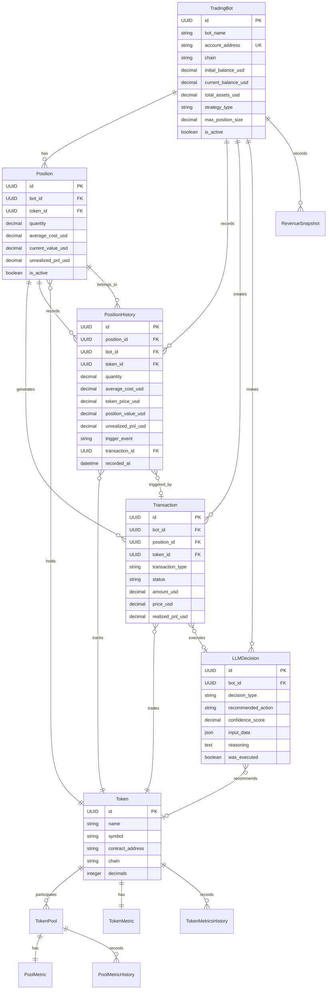

# AIP DEX 交易机器人数据结构设计

## 概述

本文档详细描述了AIP DEX交易机器人系统的完整数据结构设计，包括数据库模型、API模型和它们之间的关系。

## 数据架构层次

```
┌─────────────────────────────────────────────────────────────┐
│                    API Layer (Pydantic)                    │
├─────────────────────────────────────────────────────────────┤
│                  Business Logic Layer                      │  
├─────────────────────────────────────────────────────────────┤
│                Database Layer (SQLAlchemy)                 │
├─────────────────────────────────────────────────────────────┤
│                    PostgreSQL Database                     │
└─────────────────────────────────────────────────────────────┘
```

## 核心数据模型

### 1. 市场数据模型 (已存在)

#### Token - Token Base Information
```sql
tokens:
- id (UUID, PK)
- name (Text) - token name
- symbol (Text) - token symbol
- contract_address (Text) - contract address
- chain (Text) - blockchain network
- decimals (Integer) - decimal precision
- image_url, logo_uri (Text) - logo/image URLs
- created_at, updated_at, metrics_updated_at (DateTime)
```

#### TokenPool - 代币交易池
```sql
token_pools:
- id (UUID, PK)
- base_token_id (UUID, FK -> tokens.id)
- quote_token_id (UUID, FK -> tokens.id)
- dex (Text) - DEX名称
- chain (Text) - 所属链
- pair_address (Text) - 交易对地址
- fee_tier (Integer) - 手续费层级
- created_at, pair_created_at (DateTime)
- is_active (Boolean)
```

#### PoolMetric - 交易池实时指标
```sql
pool_metrics:
- id (UUID, PK)
- pool_id (UUID, FK -> token_pools.id)
- price_usd, price_native (DECIMAL) - 价格
- volume_1h, volume_6h, volume_24h (DECIMAL) - 交易量
- liquidity_usd, liquidity_base, liquidity_quote (DECIMAL) - 流动性
- price_change_1h, price_change_6h, price_change_24h (DECIMAL) - 价格变化
- txns_*_buys, txns_*_sells (Integer) - 交易次数
- market_cap, fdv (DECIMAL) - 市值
- data_source (Text) - 数据源
- updated_at (DateTime)
```

#### TokenMetric - 代币聚合指标
```sql
token_metrics:
- id (UUID, PK)
- token_id (UUID, FK -> tokens.id)
- avg_price_usd, weighted_price_usd (DECIMAL) - 价格
- total_volume_24h, total_liquidity_usd (DECIMAL) - 交易量和流动性
- market_cap (DECIMAL) - 市值
- rsi_14d, ma_7d, ma_30d, volatility_24h (Float) - 技术指标
- holder_count, unique_traders_24h (Integer) - 持有者数据
- buy_volume_*, sell_volume_* (DECIMAL) - 买卖量
- total_buyers_*, total_sellers_* (Integer) - 买卖人数
- price_change_* (DECIMAL) - 价格变化
- holder_change_* (Integer/DECIMAL) - 持有者变化
- 持有者分布数据 (whales_count, sharks_count等)
- 供应分布数据 (top10_supply_percent等)
- breakout_signal, trend_direction, signal_strength (Boolean/Text/Float) - 信号
- updated_at (DateTime)
```

### 2. 交易机器人模型 (新增)

#### TradingBot - 交易机器人配置
```sql
trading_bots:
- id (UUID, PK)
- bot_name (String) - 机器人名称
- account_address (String, UNIQUE) - 钱包地址
- chain (String) - 交易链 ['bsc', 'solana']

# 资金配置 (USD计价，内部精度10^18)
- initial_balance_usd (DECIMAL(30,18)) - 初始余额
- current_balance_usd (DECIMAL(30,18)) - 当前可用余额  
- total_assets_usd (DECIMAL(30,18)) - 总资产

# 交易费用配置
- gas_fee_native (DECIMAL(10,6)) - Gas费用
- trading_fee_percentage (DECIMAL(5,3)) - 交易手续费率
- slippage_tolerance (DECIMAL(5,3)) - 滑点容忍度

# 策略配置
- strategy_type (String) - 策略类型
- max_position_size (DECIMAL(5,2)) - 单币最大仓位比例
- stop_loss_percentage (DECIMAL(5,2)) - 止损百分比
- take_profit_percentage (DECIMAL(5,2)) - 止盈百分比
- min_profit_threshold (DECIMAL(5,2)) - 最低收益率阈值

# 运行控制
- min_trade_amount_usd (DECIMAL(20,2)) - 最小交易金额
- max_daily_trades (Integer) - 每日最大交易次数
- polling_interval_hours (Integer) - 轮询间隔
- llm_confidence_threshold (DECIMAL(3,2)) - LLM置信度阈值

# 功能开关
- enable_stop_loss, enable_take_profit, is_active (Boolean)

# 统计数据
- total_trades, profitable_trades (Integer)
- total_profit_usd (DECIMAL(30,18))
- max_drawdown_percentage (DECIMAL(8,4))

# 时间戳
- created_at, updated_at, last_activity_at (DateTime)
```

#### Position - 持仓记录
```sql
positions:
- id (UUID, PK)
- bot_id (UUID, FK -> trading_bots.id)
- token_id (UUID, FK -> tokens.id)

# 持仓信息 (数量使用内部精度10^18)
- quantity (DECIMAL(40,18)) - 持有数量
- average_cost_usd (DECIMAL(20,10)) - 平均成本
- total_cost_usd (DECIMAL(30,18)) - 总成本

# 当前价值
- current_price_usd (DECIMAL(20,10)) - 当前价格
- current_value_usd (DECIMAL(30,18)) - 当前市值
- unrealized_pnl_usd (DECIMAL(30,18)) - 未实现盈亏
- unrealized_pnl_percentage (DECIMAL(10,4)) - 未实现盈亏百分比

# 风险控制
- stop_loss_price, take_profit_price (DECIMAL(20,10))

# 状态
- is_active (Boolean)
- created_at, updated_at, closed_at (DateTime)

# 约束: UNIQUE(bot_id, token_id)
```

#### PositionHistory - 持仓历史记录
```sql
position_history:
- id (UUID, PK)
- position_id (UUID, FK -> positions.id)
- bot_id (UUID, FK -> trading_bots.id)
- token_id (UUID, FK -> tokens.id)

# 持仓状态快照 (数量使用内部精度10^18)
- quantity (DECIMAL(40,18)) - 当时持有数量
- average_cost_usd (DECIMAL(20,10)) - 当时平均成本
- total_cost_usd (DECIMAL(30,18)) - 当时总成本

# 价格和价值快照
- token_price_usd (DECIMAL(20,10)) - 当时代币价格
- position_value_usd (DECIMAL(30,18)) - 当时持仓市值
- unrealized_pnl_usd (DECIMAL(30,18)) - 当时未实现盈亏
- unrealized_pnl_percentage (DECIMAL(10,4)) - 当时未实现盈亏百分比

# 风险控制价格
- stop_loss_price (DECIMAL(20,10)) - 当时止损价格
- take_profit_price (DECIMAL(20,10)) - 当时止盈价格

# 市场状态快照
- market_cap_at_snapshot (DECIMAL(20,2)) - 当时市值
- volume_24h_at_snapshot (DECIMAL(20,2)) - 当时24h交易量

# 触发原因和元数据
- trigger_event (String) - ['trade_buy', 'trade_sell', 'price_update', 'stop_loss', 'take_profit', 'manual', 'periodic']
- transaction_id (UUID, FK -> transactions.id) - 关联交易

# 账户状态快照
- bot_balance_usd (DECIMAL(30,18)) - 当时机器人可用余额
- bot_total_assets_usd (DECIMAL(30,18)) - 当时机器人总资产

# 时间戳
- recorded_at (DateTime) - 记录时间
```

#### Transaction - 交易记录
```sql
transactions:
- id (UUID, PK)
- bot_id (UUID, FK -> trading_bots.id)
- position_id (UUID, FK -> positions.id)
- token_id (UUID, FK -> tokens.id)
- llm_decision_id (UUID, FK -> llm_decisions.id)

# 交易基本信息
- transaction_type (String) - ['buy', 'sell']
- status (String) - ['pending', 'executed', 'failed', 'cancelled']

# 交易数量和价格
- amount_usd (DECIMAL(30,18)) - 交易金额(买入时)
- token_amount (DECIMAL(40,18)) - 代币数量(卖出时)
- price_usd (DECIMAL(20,10)) - 执行价格

# 交易成本
- gas_cost_usd (DECIMAL(20,10)) - Gas费用
- trading_fee_usd (DECIMAL(20,10)) - 交易手续费
- total_cost_usd (DECIMAL(20,10)) - 总交易成本

# 收益计算 (仅卖出交易)
- realized_pnl_usd (DECIMAL(30,18)) - 已实现盈亏
- realized_pnl_percentage (DECIMAL(10,4)) - 已实现盈亏百分比

# 执行前后状态快照
- balance_before_usd, balance_after_usd (DECIMAL(30,18))
- position_before, position_after (DECIMAL(40,18))
- avg_cost_before, avg_cost_after (DECIMAL(20,10))

# 市场条件
- market_cap_at_trade, volume_24h_at_trade (DECIMAL(20,2))

# 时间戳
- created_at, executed_at (DateTime)
```

#### LLMDecision - LLM决策记录
```sql
llm_decisions:
- id (UUID, PK)
- bot_id (UUID, FK -> trading_bots.id)

# 决策类型
- decision_type (String) - ['sell_analysis', 'buy_analysis']
- decision_phase (String) - ['phase_1_sell', 'phase_2_buy']

# 决策输入数据
- input_data (JSON) - 输入给LLM的数据
- prompt_template (Text) - 使用的提示模板

# LLM响应
- llm_response (Text) - LLM原始响应
- reasoning (Text) - 决策推理过程
- confidence_score (DECIMAL(3,2)) - 置信度分数

# 决策结果
- recommended_action (String) - 推荐动作
- recommended_token_id (UUID, FK -> tokens.id) - 推荐代币
- recommended_amount (DECIMAL(30,18)) - 推荐金额/数量
- recommended_percentage (DECIMAL(5,2)) - 推荐卖出百分比

# 预期收益分析
- expected_return_percentage (DECIMAL(10,4)) - 预期收益率
- risk_assessment (String) - ['low', 'medium', 'high']

# 市场分析结果
- market_sentiment (String) - ['bullish', 'bearish', 'neutral']
- technical_indicators (JSON) - 技术指标分析结果
- fundamental_analysis (JSON) - 基本面分析结果

# 执行结果
- was_executed (Boolean) - 是否被执行
- execution_reason (Text) - 执行/不执行原因

# 时间戳
- created_at, execution_time (DateTime)
```

#### RevenueSnapshot - 收益快照 (基于PositionHistory汇总)
```sql
revenue_snapshots:
- id (UUID, PK)
- bot_id (UUID, FK -> trading_bots.id)

# 资产快照 (基于PositionHistory汇总计算)
- total_assets_usd (DECIMAL(30,18)) - 总资产
- available_balance_usd (DECIMAL(30,18)) - 可用余额
- total_positions_value_usd (DECIMAL(30,18)) - 持仓总价值 (汇总所有position_value_usd)

# 收益数据 (基于PositionHistory + Transaction计算)
- total_unrealized_pnl_usd (DECIMAL(30,18)) - 未实现盈亏总额 (汇总所有unrealized_pnl_usd)
- total_realized_pnl_usd (DECIMAL(30,18)) - 已实现盈亏总额 (来自Transaction)
- total_profit_usd (DECIMAL(30,18)) - 累计盈利 (unrealized + realized)
- total_profit_percentage (DECIMAL(10,4)) - 累计收益率
- daily_profit_usd (DECIMAL(30,18)) - 当日盈利
- daily_profit_percentage (DECIMAL(10,4)) - 当日收益率

# 交易统计 (基于Transaction计算)
- total_trades, profitable_trades (Integer)
- win_rate (DECIMAL(5,2)) - 胜率
- average_profit_per_trade (DECIMAL(20,10)) - 平均每笔盈利

# 风险指标 (基于历史RevenueSnapshot计算)
- max_drawdown_percentage (DECIMAL(8,4)) - 最大回撤
- current_drawdown_percentage (DECIMAL(8,4)) - 当前回撤
- volatility (DECIMAL(8,4)) - 波动率
- sharpe_ratio (DECIMAL(8,4)) - 夏普比率

# 持仓统计 (基于PositionHistory汇总计算)
- active_positions_count (Integer) - 活跃持仓数量
- total_position_cost_usd (DECIMAL(30,18)) - 持仓总成本 (汇总所有total_cost_usd)
- largest_position_value_usd (DECIMAL(30,18)) - 最大单个持仓价值
- largest_position_percentage (DECIMAL(5,2)) - 最大持仓比例
- position_concentration_risk (DECIMAL(5,2)) - 持仓集中度风险

# 数据来源追踪
- position_history_count (Integer) - 基础持仓历史记录数量
- calculation_method (String) - 计算方法版本 ['v1.0', 'v1.1']
- data_completeness (DECIMAL(5,2)) - 数据完整性百分比

# 快照类型和时间
- snapshot_type (String) - ['hourly', 'daily', 'manual', 'triggered']
- snapshot_time (DateTime) - 快照时间点 (与PositionHistory的recorded_at对应)
- created_at (DateTime) - 记录创建时间
```

#### TradingConfig - 交易配置模板
```sql
trading_configs:
- id (UUID, PK)
- strategy_name (String, UNIQUE) - 策略名称
- strategy_description (Text) - 策略描述
- risk_level (String) - ['low', 'medium', 'high']

# 默认参数
- default_max_position_size (DECIMAL(5,2))
- default_stop_loss_percentage (DECIMAL(5,2))
- default_take_profit_percentage (DECIMAL(5,2))
- default_min_profit_threshold (DECIMAL(5,2))
- default_max_daily_trades (Integer)
- default_confidence_threshold (DECIMAL(3,2))

# 提示模板
- sell_prompt_template (Text) - 卖出决策提示模板
- buy_prompt_template (Text) - 买入决策提示模板

# 状态
- is_active (Boolean)
- created_at, updated_at (DateTime)
```

## 实体关系图



## 数据精度设计

### 金额精度体系
- **内部存储精度**: 10^18 (18位小数)
- **USD价格精度**: 10^10 (10位小数)
- **代币数量精度**: 10^18 (18位小数)
- **百分比精度**: 最多4位小数

### 精度字段说明
```sql
-- 资金相关 (USD计价)
DECIMAL(30, 18) - 支持最大999万亿USD，精度到wei级别
DECIMAL(20, 10) - 价格精度，支持极小价格代币
DECIMAL(20, 2)  - 市值等大数值，2位小数精度

-- 代币数量
DECIMAL(40, 18) - 支持超大供应量代币

-- 百分比
DECIMAL(10, 4)  - 支持-999999.9999%到999999.9999%
DECIMAL(8, 4)   - 风险指标，如回撤、波动率
DECIMAL(5, 2)   - 一般百分比配置
```

## 关键业务逻辑

### 1. 持仓历史与收益记录的关系

#### 数据层级设计
```
机器人整体表现 (宏观)
    ↓
RevenueSnapshot：基于时间点的整体收益评价
    ↑ (汇总计算)
持仓明细变化 (微观)  
    ↓
PositionHistory：每个代币持仓的详细状态记录
```

#### 计算关系
```python
# RevenueSnapshot 的关键字段应该基于 PositionHistory 计算
def calculate_revenue_snapshot(bot_id: str, snapshot_time: datetime):
    # 1. 获取快照时间点的所有持仓状态
    position_histories = get_position_histories_at_time(bot_id, snapshot_time)
    
    # 2. 汇总持仓数据
    total_positions_value_usd = sum(pos.position_value_usd for pos in position_histories)
    total_unrealized_pnl_usd = sum(pos.unrealized_pnl_usd for pos in position_histories)
    active_positions_count = len([pos for pos in position_histories if pos.quantity > 0])
    
    # 3. 计算收益指标
    total_profit_usd = total_unrealized_pnl_usd + realized_pnl_from_transactions
    total_profit_percentage = total_profit_usd / initial_balance * 100
    
    # 4. 计算风险指标
    largest_position_value = max(pos.position_value_usd for pos in position_histories)
    largest_position_percentage = largest_position_value / total_assets_usd * 100
    
    return RevenueSnapshot(
        total_positions_value_usd=total_positions_value_usd,
        total_profit_usd=total_profit_usd,
        total_profit_percentage=total_profit_percentage,
        active_positions_count=active_positions_count,
        largest_position_percentage=largest_position_percentage,
        # ... 其他计算字段
    )
```

#### 时间同步机制
- **同步快照**：RevenueSnapshot 和 PositionHistory 在相同时间点生成
- **触发联动**：当 PositionHistory 记录时，同时触发 RevenueSnapshot 计算
- **数据一致性**：确保快照时间的数据完全对应

#### 实际应用场景

**交易历史时间轴**：
```python
# 获取机器人的收益概览时间线
def get_bot_revenue_timeline(bot_id: str, start_date: datetime, end_date: datetime):
    revenue_snapshots = get_revenue_snapshots_by_time_range(bot_id, start_date, end_date)
    return [
        {
            "time": snapshot.snapshot_time,
            "total_assets": snapshot.total_assets_usd,
            "profit_percentage": snapshot.total_profit_percentage,
            "positions_count": snapshot.active_positions_count,
            "trigger": snapshot.snapshot_type
        }
        for snapshot in revenue_snapshots
    ]
```

**决策分析**：
```python
# 分析特定决策对收益的影响
def analyze_decision_impact(llm_decision_id: str):
    decision = get_llm_decision(llm_decision_id)
    
    # 获取决策前后的收益快照
    before_snapshot = get_revenue_snapshot_before(decision.bot_id, decision.created_at)
    after_snapshot = get_revenue_snapshot_after(decision.bot_id, decision.execution_time)
    
    # 获取相关的持仓历史变化
    position_changes = get_position_history_in_period(
        decision.bot_id, 
        decision.created_at, 
        decision.execution_time + timedelta(hours=1)
    )
    
    return {
        "decision_summary": decision.recommended_action,
        "profit_impact": after_snapshot.total_profit_usd - before_snapshot.total_profit_usd,
        "position_changes": position_changes,
        "risk_change": after_snapshot.position_concentration_risk - before_snapshot.position_concentration_risk
    }
```

#### 数据质量保证
- **完整性验证**：`data_completeness` 字段记录数据完整度
- **版本追踪**：`calculation_method` 记录计算算法版本
- **源数据计数**：`position_history_count` 记录基础数据条数
- **时间对齐检查**：验证 `snapshot_time` 与 `PositionHistory.recorded_at` 的一致性

### 2. 持仓历史记录

#### 记录触发时机
```python
# 交易触发
trigger_event = 'trade_buy'   # 买入交易完成时
trigger_event = 'trade_sell'  # 卖出交易完成时

# 价格变化触发
trigger_event = 'price_update'  # 代币价格显著变化时(如>5%)

# 风险控制触发  
trigger_event = 'stop_loss'     # 触发止损时
trigger_event = 'take_profit'   # 触发止盈时

# 定期记录
trigger_event = 'periodic'      # 定期快照(如每小时)
trigger_event = 'manual'        # 手动记录
```

#### 历史记录策略
- **交易时必记录**：每次买入/卖出完成后立即记录
- **价格变化记录**：当代币价格变化超过5%时记录
- **定期快照**：每小时自动记录一次当前状态
- **风险事件记录**：触发止损/止盈时记录
- **数据保留**：保留所有历史记录，支持完整的时间序列分析

#### 性能优化
- 使用数据库分区按时间范围存储
- 批量插入历史记录
- 异步处理价格更新触发的记录
- 定期清理过期数据(可配置保留期)

### 2. 持仓成本计算

#### 买入时更新平均成本
```python
new_avg_cost = (
    (existing_quantity * existing_avg_cost + 
     purchase_quantity * purchase_price + 
     transaction_cost) 
    / (existing_quantity + purchase_quantity)
)
```

#### 卖出时更新平均成本
```python
if remaining_quantity > 0:
    new_avg_cost = (
        (remaining_quantity * existing_avg_cost + transaction_cost) 
        / remaining_quantity
    )
else:
    new_avg_cost = 0  # 全部卖出，成本重置为0
```

#### 预期收益计算
```python
expected_return = (
    (sell_quantity * (current_price - existing_avg_cost) - transaction_cost) 
    / (sell_quantity * existing_avg_cost)
)
```

#### 数据约束规则
```sql
-- Position 表约束
CHECK (quantity >= 0)
CHECK ((quantity = 0 AND average_cost_usd = 0) OR (quantity > 0 AND average_cost_usd > 0))

-- PositionHistory 表约束  
CHECK (quantity >= 0)
CHECK ((quantity = 0 AND average_cost_usd = 0) OR (quantity > 0 AND average_cost_usd > 0))
CHECK (token_price_usd > 0)
```

**约束逻辑说明**：
- 当持仓数量为0时，平均成本必须为0（全部卖出情况）
- 当持仓数量大于0时，平均成本必须大于0（正常持仓情况）
- 这确保了业务逻辑的一致性：无持仓时无成本

### 2. 交易成本计算

```python
# Gas费用 (USD)
if chain == 'bsc':
    gas_cost_usd = 0.00003 * current_wbnb_price_usd
elif chain == 'solana':
    gas_cost_usd = 0.001 * current_sol_price_usd

# 交易手续费 (USD)
trading_fee_usd = trade_amount_usd * trading_fee_percentage / 100

# 总交易成本
total_cost_usd = gas_cost_usd + trading_fee_usd
```

### 3. 收益指标计算

#### 收益率
```python
total_profit_percentage = (
    (total_assets_usd - initial_balance_usd) / initial_balance_usd * 100
)
```

#### 胜率
```python
win_rate = profitable_trades / total_trades * 100 if total_trades > 0 else 0
```

#### 夏普比率
```python
# 需要历史收益数据计算
sharpe_ratio = (avg_return - risk_free_rate) / std_dev_return
```

## API数据模型 (Pydantic)

### 请求模型
- `TradingBotCreate` - 创建机器人
- `TradingBotUpdate` - 更新机器人配置
- `TransactionCreate` - 创建交易
- `SellDecisionRequest` - 卖出决策请求
- `BuyDecisionRequest` - 买入决策请求

### 响应模型
- `TradingBotResponse` - 机器人详情
- `TradingBotSummary` - 机器人摘要
- `PositionResponse` - 持仓详情
- `PositionHistoryResponse` - 持仓历史详情
- `PositionHistoryList` - 持仓历史列表
- `TransactionResponse` - 交易详情
- `LLMDecisionResponse` - LLM决策详情
- `RevenueSnapshot` - 收益快照
- `PortfolioSummary` - 投资组合摘要

### 业务模型
- `TokenMarketData` - 代币市场数据
- `TradingDecisionResponse` - 交易决策响应
- `RevenueMetrics` - 收益指标
- `SystemStatus` - 系统状态

## 数据库索引设计

### 关键索引设计
```sql
-- 机器人查询
CREATE INDEX idx_trading_bots_account_chain ON trading_bots(account_address, chain);
CREATE INDEX idx_trading_bots_active ON trading_bots(is_active);

-- 持仓查询
CREATE INDEX idx_positions_bot_active ON positions(bot_id, is_active);
CREATE INDEX idx_positions_token ON positions(token_id);

-- 持仓历史查询
CREATE INDEX idx_position_history_position_recorded ON position_history(position_id, recorded_at);
CREATE INDEX idx_position_history_bot_recorded ON position_history(bot_id, recorded_at);
CREATE INDEX idx_position_history_token_recorded ON position_history(token_id, recorded_at);
CREATE INDEX idx_position_history_trigger ON position_history(trigger_event);

-- 交易查询
CREATE INDEX idx_transactions_bot_created ON transactions(bot_id, created_at);
CREATE INDEX idx_transactions_status ON transactions(status);
CREATE INDEX idx_transactions_type_date ON transactions(transaction_type, created_at);

-- LLM决策查询
CREATE INDEX idx_llm_decisions_bot_created ON llm_decisions(bot_id, created_at);
CREATE INDEX idx_llm_decisions_executed ON llm_decisions(was_executed);

-- 收益快照查询
CREATE INDEX idx_revenue_bot_created ON revenue_snapshots(bot_id, created_at);
CREATE INDEX idx_revenue_bot_snapshot_time ON revenue_snapshots(bot_id, snapshot_time);
CREATE INDEX idx_revenue_type ON revenue_snapshots(snapshot_type);
CREATE INDEX idx_revenue_snapshot_time ON revenue_snapshots(snapshot_time);
CREATE INDEX idx_revenue_calculation_method ON revenue_snapshots(calculation_method);

-- 代币和市场数据索引 (已存在)
CREATE INDEX idx_tokens_symbol ON tokens(symbol);
CREATE INDEX idx_tokens_contract_chain ON tokens(contract_address, chain);
CREATE INDEX idx_token_metrics_updated ON token_metrics(token_id, updated_at);
```

## 数据一致性约束

### 数据库约束
- 唯一性约束：机器人账户地址、代币合约地址+链
- 外键约束：确保引用完整性
- 检查约束：数值范围、枚举值验证
- 非空约束：关键字段必填

### 业务规则约束
- 交易金额不能超过可用余额
- 卖出数量不能超过持仓数量
- 百分比参数在合理范围内
- 时间戳逻辑一致性

## 数据完整性验证

### 边界情况处理
```python
# 1. 全部卖出场景验证
def validate_position_closure(position_id: str):
    """验证持仓关闭的数据一致性"""
    position = get_position(position_id)
    latest_history = get_latest_position_history(position_id)
    
    assert position.quantity == 0
    assert position.average_cost_usd == 0
    assert latest_history.quantity == 0
    assert latest_history.average_cost_usd == 0
    assert latest_history.trigger_event in ['trade_sell', 'stop_loss', 'take_profit']

# 2. 首次买入场景验证
def validate_first_purchase(position_id: str):
    """验证首次买入的数据一致性"""
    position = get_position(position_id)
    first_history = get_first_position_history(position_id)
    
    assert position.quantity > 0
    assert position.average_cost_usd > 0
    assert first_history.trigger_event == 'trade_buy'
    assert first_history.quantity > 0
    assert first_history.average_cost_usd > 0

# 3. 收益计算一致性验证
def validate_revenue_calculation(bot_id: str, snapshot_time: datetime):
    """验证收益快照计算的准确性"""
    snapshot = get_revenue_snapshot(bot_id, snapshot_time)
    position_histories = get_position_histories_at_time(bot_id, snapshot_time)
    
    # 验证持仓总价值
    calculated_total_value = sum(ph.position_value_usd for ph in position_histories)
    assert abs(snapshot.total_positions_value_usd - calculated_total_value) < 0.01
    
    # 验证未实现盈亏
    calculated_unrealized_pnl = sum(ph.unrealized_pnl_usd for ph in position_histories)
    assert abs(snapshot.total_unrealized_pnl_usd - calculated_unrealized_pnl) < 0.01
```

### 数据修复工具
```python
# 修复历史数据中的约束违反问题
def fix_legacy_constraint_violations():
    """修复旧数据中quantity=0但average_cost_usd>0的问题"""
    
    # 修复Position表
    positions_to_fix = session.query(Position).filter(
        Position.quantity == 0,
        Position.average_cost_usd > 0
    ).all()
    
    for position in positions_to_fix:
        position.average_cost_usd = 0
        position.updated_at = datetime.now(timezone.utc)
        
    # 修复PositionHistory表  
    histories_to_fix = session.query(PositionHistory).filter(
        PositionHistory.quantity == 0,
        PositionHistory.average_cost_usd > 0
    ).all()
    
    for history in histories_to_fix:
        history.average_cost_usd = 0
    
    session.commit()
    print(f"修复了 {len(positions_to_fix)} 个Position记录和 {len(histories_to_fix)} 个PositionHistory记录")

# 数据一致性检查工具
def check_data_consistency(bot_id: str):
    """全面检查机器人数据的一致性"""
    issues = []
    
    # 检查持仓与历史的一致性
    positions = get_active_positions(bot_id)
    for position in positions:
        latest_history = get_latest_position_history(position.id)
        if not latest_history:
            issues.append(f"Position {position.id} 缺少历史记录")
            continue
            
        if abs(position.quantity - latest_history.quantity) > 0.000001:
            issues.append(f"Position {position.id} 数量不一致")
            
        if abs(position.average_cost_usd - latest_history.average_cost_usd) > 0.0001:
            issues.append(f"Position {position.id} 平均成本不一致")
    
    # 检查收益快照的计算准确性
    recent_snapshots = get_recent_revenue_snapshots(bot_id, limit=5)
    for snapshot in recent_snapshots:
        try:
            validate_revenue_calculation(bot_id, snapshot.snapshot_time)
        except AssertionError as e:
            issues.append(f"收益快照 {snapshot.id} 计算错误: {e}")
    
    return issues
```

### 约束条件总结
```sql
-- 核心约束条件
ALTER TABLE positions ADD CONSTRAINT check_cost_quantity_consistency 
    CHECK ((quantity = 0 AND average_cost_usd = 0) OR (quantity > 0 AND average_cost_usd > 0));

ALTER TABLE position_history ADD CONSTRAINT check_history_cost_quantity_consistency 
    CHECK ((quantity = 0 AND average_cost_usd = 0) OR (quantity > 0 AND average_cost_usd > 0));

-- 其他重要约束
ALTER TABLE trading_bots ADD CONSTRAINT check_balance_positive 
    CHECK (current_balance_usd >= 0);
    
ALTER TABLE transactions ADD CONSTRAINT check_amount_positive 
    CHECK ((transaction_type = 'buy' AND amount_usd > 0) OR (transaction_type = 'sell' AND token_amount > 0));
```

## 扩展性考虑

### 水平扩展
- 支持按机器人ID分片
- 历史数据可按时间分表
- 读写分离支持

### 垂直扩展
- 预留JSON字段存储扩展配置
- 版本化的策略模板系统
- 插件化的决策引擎接口

### 监控和审计
- 所有重要操作记录审计日志
- 关键指标实时监控
- 异常情况告警机制

## 安全考虑

### 数据安全
- 敏感信息加密存储
- API访问权限控制
- 数据传输加密

### 业务安全
- 交易限额控制
- 异常交易检测
- 风险管理规则

这个数据结构设计提供了完整的交易机器人系统数据基础，支持复杂的交易策略、详细的收益分析和灵活的扩展需求。 