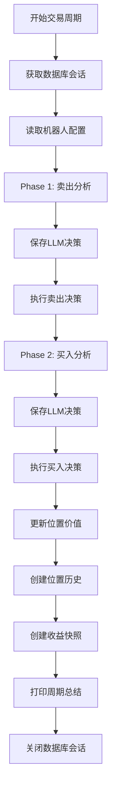

# 📊 数据库操作总结 - trading_bot.py

## 🔍 **数据库会话管理**

### ✅ **正确的会话管理模式**

```python
# 模式1: 独立会话（推荐用于简单操作）
db = next(get_db())
try:
    # 数据库操作
    result = db.query(Model).filter(...).all()
finally:
    db.close()

# 模式2: 共享会话（用于复杂事务）
db = next(get_db())
try:
    # 多个相关操作
    operation1(db)
    operation2(db)
    # 统一提交
    db.commit()
finally:
    db.close()
```

### 📋 **当前文件中的会话使用**

| 方法 | 会话模式 | 状态 | 说明 |
|------|----------|------|------|
| `initialize()` | 独立会话 | ✅ 正确 | 创建机器人，独立事务 |
| `_trading_cycle()` | 共享会话 | ✅ 正确 | 整个交易周期使用同一会话 |
| `_update_positions()` | 独立会话 | ✅ 正确 | 独立的位置更新操作 |
| `_execute_buy_decision()` | 共享会话 | ✅ 正确 | 使用传入的会话 |
| `_execute_sell_decisions()` | 共享会话 | ✅ 正确 | 使用传入的会话 |

## 🔄 **事务处理策略**

### ✅ **已修复的事务处理**

#### 1. **位置更新操作**
```python
async def _update_positions_with_db(self, db: Session):
    try:
        # 批量更新所有位置
        for pos in positions:
            success = await self.trading_service._update_position_current_value(db, pos)
        
        # 统一提交
        if updated_count > 0:
            db.commit()  # ✅ 正确：统一提交
    except Exception as e:
        # 错误处理，不单独回滚
```

#### 2. **位置历史创建**
```python
async def _create_cycle_position_history(self, db: Session):
    try:
        # 批量创建位置历史
        for position in positions:
            success = await self.trading_service._create_position_history(db, position, "periodic", None)
        
        # 统一提交
        if success_count > 0:
            db.commit()  # ✅ 正确：统一提交
    except Exception as e:
        # 错误处理
```

#### 3. **LLM决策保存** ✅ **已修复**
```python
async def _save_llm_decision(self, db: Session, analysis_result: Dict[str, Any], decision_type: str, decision_phase: str):
    try:
        # 创建LLM决策记录
        llm_decision = LLMDecision(...)
        db.add(llm_decision)
        db.flush()  # ✅ 正确：不提交，让调用方处理
    except Exception as e:
        # 不单独回滚，让调用方处理
```

### 🛒 **交易执行事务**

#### 买入交易
```python
# _execute_buy_decision() -> trading_service.execute_buy_order()
# ✅ 正确：trading_service 内部处理完整事务
# - 创建/更新位置
# - 创建交易记录
# - 创建位置历史
# - 统一提交
```

#### 卖出交易
```python
# _execute_sell_decisions() -> trading_service.execute_sell_order()
# ✅ 正确：trading_service 内部处理完整事务
# - 更新位置
# - 创建交易记录
# - 创建位置历史
# - 统一提交
```

## 📊 **数据库操作流程**

### 🔄 **交易周期流程**



### 💾 **数据持久化策略**

| 操作类型 | 提交时机 | 事务范围 | 说明 |
|----------|----------|----------|------|
| **LLM决策** | 分析阶段 | 独立 | 每个分析阶段单独保存 |
| **交易执行** | 执行时 | 完整 | 包含位置、交易、历史 |
| **位置更新** | 周期结束 | 批量 | 批量更新所有位置 |
| **位置历史** | 周期结束 | 批量 | 批量创建所有历史 |
| **收益快照** | 周期结束 | 独立 | 独立快照记录 |

## ⚠️ **注意事项**

### 1. **事务边界**
- ✅ 每个交易周期使用一个数据库会话
- ✅ 相关操作在同一个事务中
- ✅ 独立操作使用独立事务

### 2. **错误处理**
- ✅ 不重复提交事务
- ✅ 不重复回滚事务
- ✅ 让调用方处理事务状态

### 3. **性能优化**
- ✅ 批量操作减少提交次数
- ✅ 合理使用 flush() 获取ID
- ✅ 及时关闭数据库会话

## 🔧 **最佳实践**

### 1. **会话管理**
```python
# ✅ 推荐：使用上下文管理器
from contextlib import contextmanager

@contextmanager
def get_db_session():
    db = next(get_db())
    try:
        yield db
    finally:
        db.close()

# 使用
with get_db_session() as db:
    # 数据库操作
    pass
```

### 2. **事务处理**
```python
# ✅ 推荐：统一事务处理
async def complex_operation(db: Session):
    try:
        # 多个相关操作
        await operation1(db)
        await operation2(db)
        await operation3(db)
        
        # 统一提交
        db.commit()
        return True
    except Exception as e:
        # 统一回滚
        db.rollback()
        return False
```

### 3. **错误恢复**
```python
# ✅ 推荐：优雅的错误处理
async def safe_operation(db: Session):
    try:
        # 数据库操作
        result = await risky_operation(db)
        db.commit()
        return result
    except Exception as e:
        db.rollback()
        logger.error(f"Operation failed: {e}")
        return None
```

## 📈 **监控和调试**

### 1. **事务监控**
- 添加事务开始/结束日志
- 监控事务执行时间
- 记录事务成功/失败率

### 2. **数据一致性检查**
- 定期验证位置数据一致性
- 检查交易和位置的关联关系
- 验证历史记录的完整性

### 3. **性能监控**
- 监控数据库连接池使用情况
- 跟踪慢查询
- 监控事务并发情况

---

**总结**: 经过修复，`trading_bot.py` 中的数据库操作现在遵循了正确的事务处理模式，确保了数据一致性和操作可靠性。 

# 创建新记录
try:
    new_record = Model(...)
    db.add(new_record)
    db.flush()  # 检查约束
    # 如果没有异常，继续操作
    db.commit()
except IntegrityError:
    db.rollback()
    # 处理约束违反

# ✅ 推荐
parent = Parent(...)
db.add(parent)
db.flush()  # 获取parent.id

child = Child(parent_id=parent.id, ...)
db.add(child)
db.commit()  # 统一提交 