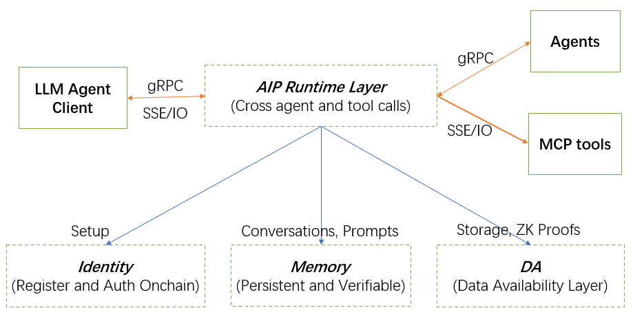

# **Agent Interoperability Protocol (AIP): Building the Open Agent Internet**

- A Web3-Native Protocol for On-Chain Identity, Decentralized Memory & Cross-Platform Agent Interoperability
- Code in https://github.com/unibaseio/aip-agent
- Docs in https://openos-labs.gitbook.io/unibase-docs/aip

## **Abstract**

The rapidly expanding field of Artificial Intelligence (AI) agent development is currently experiencing significant fragmentation. Existing protocols, such as Anthropic's Multi-Agent Communication Protocol (MCP) and Google's Agent-to-Agent (A2A) protocol, have critical limitations, notably a lack of cross-platform identity, decentralized memory, and verifiable authorization. These shortcomings severely impede genuine multi-agent collaboration and hinder the realization of a truly open agent internet.

To address these systemic challenges, Unibase has developed the Agent Interoperability Protocol (AIP), introducing the first Web3-native multi-agent communication standard. This protocol is strategically positioned to fill a crucial gap in the evolving AI landscape. AIP's very design as "Web3-native" represents a fundamental response to the inherent limitations of centralized and fragmented approaches, establishing a new paradigm for secure, transparent, and interoperable AI. It is not merely an alternative but a foundational shift towards an ecosystem where AI innovation can flourish without the constraints of siloed systems.

AIP offers a comprehensive, full-stack solution by seamlessly integrating decentralized memory via Membase, establishing robust on-chain identity and access control through Zero-Knowledge Proofs (ZK) and blockchain technology, and facilitating broad cross-platform communication. This integrated approach enables seamless collaboration among diverse AI agents and allows for direct Large Language Model (LLM) integration.

Ultimately, AIP's vision is to foster a truly open agent internet, where agents can establish verifiable identities, share persistent decentralized memory, and collaborate across a multitude of platforms, thereby democratizing access to advanced AI capabilities and fostering unprecedented innovation.

## **1\. Introduction: The Dawn of an Open Agent Internet**

### **1.1. The Evolving Landscape of AI Agents**

Artificial Intelligence is rapidly transforming nearly every aspect of human life, from industrial processes to communication and creative endeavors. A significant driver of this transformation is the advancements in Large Language Models (LLMs), which have enabled the development of increasingly sophisticated AI agents. These autonomous entities are moving beyond isolated functions, evolving into collaborative systems capable of performing complex tasks that require interaction with other agents and various tools. This shift necessitates more robust and standardized mechanisms for agent interaction and data management.

### **1.2. Problem Statement: Limitations of Current Agent Protocols**

Despite the rapid progress in AI, a fundamental challenge persists: AI agents largely operate within isolated environments. They lack a standardized, secure, and persistent method to communicate, share information, and manage their identities across disparate platforms and ecosystems. This fragmentation stifles the potential for true multi-agent collaboration and limits the scope of what AI systems can collectively achieve.

Existing agent protocols, while serving specific purposes, fall short in addressing these critical interoperability gaps:

* **MCP (Anthropic):** Primarily designed for integrating LLMs with tools and data, MCP lacks inherent support for cross-agent communication, built-in memory capabilities, verifiable on-chain identity, and decentralization. This confines agents to more siloed operations, limiting their ability to engage in complex, multi-party interactions.
* **A2A (Google):** While focused on agent-to-agent communication, A2A similarly lacks crucial features such as seamless tool integration, persistent memory support, on-chain identity, and decentralized architecture. Its design does not inherently support the verifiable, trustless interactions increasingly demanded by advanced AI applications.

The fundamental gaps in both traditional protocols—specifically the absence of cross-platform identity, decentralized memory, and verifiable authorization—lead to fragmented, insecure, and non-persistent agent interactions. This concentration of AI power and infrastructure in the hands of a few entities, as observed in the broader AI landscape, can stifle competition, impede progress, and restrict who can develop and benefit from cutting-edge AI applications. The current state describes a closed or fragmented agent ecosystem, where trust is often centralized and data ownership is ambiguous.

### **1.3. Introducing AIP: A Web3-Native Solution**

In response to these pervasive challenges, Unibase has introduced the Agent Interoperability Protocol (AIP), heralded as the first Web3-native multi-agent communication standard. AIP is designed to overcome the critical limitations of existing protocols by providing a comprehensive, full-stack solution for agent interoperability.

The core promise of AIP is to enable agents to establish verifiable on-chain identities, share decentralized memory, and collaborate seamlessly across diverse platforms. Its "Web3-native" design is not merely a buzzword; it represents a fundamental architectural choice that leverages the core principles of decentralized technologies. This foundation ensures transparency, enhanced security, and true data ownership for agents and their interactions. By adopting a Web3-native approach, AIP directly addresses the trust deficits, data integrity issues, and censorship vulnerabilities that are inherent in centralized systems. This positions AIP as a critical infrastructure for the future of AI where trust, transparency, and verifiable interactions are paramount.

### **1.4. Protocol Comparison: AIP vs. MCP vs. A2A**

The following table visually demonstrates AIP's comprehensive advantages over existing protocols, highlighting its unique value proposition and the breadth of its capabilities.

| Feature | MCP (Anthropic) | A2A (Google) | AIP (Unibase) 🚀 |
| :---- | :---- | :---- | :---- |
| **Primary Focus** | LLM & tool/data integration | Agent-to-agent communication | Full agent interoperability \+ tool access |
| **Cross-Agent Communication** | ❌ | ✅ | ✅ |
| **Tool Integration** | ✅ | ❌ | ✅ |
| **Built-in Memory Support** | ❌ | ❌ | ✅ (via Membase) |
| **On-Chain Identity & Auth** | ❌ | ❌ | ✅ (via ZK \+ blockchain) |
| **Agent/Tool Discovery** | ✅ | ❌ | ✅ (built-in discovery & registry) |
| **Protocol Compatibility** | MCP only | A2A only | ✅ (MCP \+ gRPC compatible) |
| **Decentralization** | ❌ | ❌ | ✅ (Web3-native) |

This side-by-side comparison immediately highlights AIP's comprehensive nature and its superior feature set, particularly in areas like built-in memory, on-chain identity, and decentralization. It reinforces the narrative that existing solutions are incomplete and that AIP presents a definitive answer to the challenges of agent interoperability, directly addressing the unique value proposition of the project.

## **2\. The Agent Interoperability Protocol (AIP) Solution**

This section details how AIP specifically addresses the identified problems, outlining its overarching purpose and the fundamental principles guiding its design.

### **2.1. Purpose and Vision of AIP**

AIP's primary purpose is to enable seamless and secure collaboration among a diverse array of AI agents, regardless of their underlying platform or ecosystem. This goes beyond mere communication; it encompasses a holistic environment for agent interaction.

* **Enabling Collaboration:** AIP facilitates complex interactions, allowing agents to work together on tasks that require shared understanding and coordinated action.  
* **Decentralized Memory Sharing:** A cornerstone of AIP is its ability to facilitate the sharing of decentralized memory. This ensures agents can maintain persistent knowledge bases, dialogue histories, and prompts in a tamper-proof manner via Membase, allowing for continuous learning and contextual awareness.  
* **Verifiable Identity:** AIP empowers agents with verifiable on-chain identities and programmable permissioning. This is crucial for secure and auditable interactions, providing a robust framework for access control and accountability in multi-agent systems.  
* **Facilitating an Open Agent Internet:** The ultimate vision driving AIP is the creation of a truly open and interconnected agent internet. This vision represents a future where AI innovation is democratized and composable, leading to a proliferation of new AI services and applications that were previously impossible due to technical and trust barriers. This paradigm shift also implies a redistribution of value creation from centralized platforms to decentralized networks, fostering a more equitable and dynamic AI ecosystem.

### **2.2. Core Principles Driving AIP**

The design and development of AIP are guided by several core principles that underpin its robust and future-proof architecture:

* **Decentralization:** Built fundamentally on Web3 principles, AIP ensures that control, data, and identity are distributed across a network, thereby eliminating single points of failure, mitigating censorship risks, and promoting a more resilient ecosystem.  
* **Interoperability:** AIP is meticulously designed for compatibility with both existing and emerging protocols, including MCP and gRPC. This forward-thinking approach ensures broad adoption and seamless integration into the current diverse AI landscape, allowing agents built on other protocols to readily leverage AIP's advanced features.  
* **Security & Trustlessness:** By leveraging blockchain technology for identity management and Zero-Knowledge Proofs (ZK) for authorization, AIP prioritizes verifiable security and enables trustless interactions among agents. This cryptographic assurance is vital for sensitive applications.  
* **Persistence & Scalability:** Through its integration with Membase and Unibase DA, AIP provides robust, scalable, and persistent memory solutions for agents, ensuring their long-term knowledge and operational context are preserved.  
* **Autonomy:** By enabling direct LLM integration and comprehensive tool access, AIP empowers agents with enhanced autonomy, allowing them to execute complex workflows and make informed decisions without constant human oversight.

The description of AIP as a "full-stack solution" is a significant claim, indicating a comprehensive architectural approach that goes beyond addressing a single pain point. The integration of memory, identity, and agent communication into a single decentralized standard directly addresses the fragmentation of existing solutions, where these components are often separate or non-existent. This architectural choice demonstrates a mature understanding of the systemic requirements for robust agent collaboration, moving beyond point solutions to a cohesive infrastructure. Such an integrated system can significantly accelerate adoption by reducing the complexity of integration for developers, providing a complete ecosystem rather than just a protocol.

## **3\. Key Features and Advantages of AIP**

This section details the specific functionalities that differentiate AIP from its predecessors and highlight its unique value proposition.

### **3.1. Cross-Platform Interoperability**

AIP establishes a standardized communication framework that enables agents from disparate ecosystems to interact seamlessly. This standardization is crucial for breaking down the silos that currently characterize the AI agent landscape. Furthermore, its design ensures compatibility with widely used protocols such as MCP and gRPC. This means that agents developed using other communication standards can potentially leverage AIP's advanced features, fostering a more interconnected and collaborative environment across the entire agent ecosystem.

### **3.2. Decentralized Memory Layer (Membase)**

A critical differentiator for AIP is its decentralized memory layer, Membase. This component allows for the persistent storage of vital agent data, including prompts, dialogue histories, and extensive knowledge bases. Unlike traditional protocols that lack built-in memory support, Membase ensures that this long-term memory is not only persistent but also decentralized and tamper-proof. This verifiable and immutable record of an agent's knowledge and interactions is fundamental for reliable, auditable, and continuously learning agent behavior, directly addressing a significant limitation of existing systems.

### **3.3. On-Chain Identity & Access Control**

Each agent within the AIP ecosystem is endowed with a unique, verifiable identity stored on a blockchain. This on-chain identity is foundational for secure authentication and interaction within the multi-agent network. Coupled with this identity is programmable permissioning, which allows for granular control over an agent's access to resources and its interaction capabilities. The integration of Zero-Knowledge Proofs (ZK) for on-chain identity and authorization further enhances privacy and security by enabling verification without revealing underlying sensitive information. The consistent emphasis on "Web3-native" and "Decentralization" for AIP is not merely a marketing term; it reflects a fundamental architectural choice with profound implications for trust, ownership, and censorship resistance. The absence of decentralization in traditional protocols leads to vulnerabilities related to trust, data integrity, and censorship, which are unacceptable for autonomous, interacting agents handling sensitive information or value. AIP's Web3-native design, by integrating blockchain for identity and authorization, and decentralized memory, fundamentally changes the trust model for AI agents, enabling truly autonomous and verifiable interactions in a way centralized systems cannot. This positions AIP as critical infrastructure for the future of AI where trust and transparency are paramount.

### **3.4. Direct LLM Integration**

AIP facilitates direct integration with Large Language Models (LLMs), enabling them to directly call AIP agents and tools. This capability streamlines the creation of complex, autonomous multi-agent workflows by eliminating the need for intermediaries. It empowers developers to build sophisticated AI applications where LLMs can orchestrate and leverage a network of specialized agents and tools to achieve intricate objectives.

## **4\. AIP Technical Architecture and Components**

This section provides a detailed breakdown of AIP's underlying technology and architecture, explaining how its core components work together to deliver the promised functionalities.

### **4.1. System Architecture Overview**

_Demonstration of AIP Architecture_

The overarching architecture of AIP involves a streamlined interaction flow. Large Language Models (LLMs) interact directly with AIP Agents, which can be either full-featured or custom-built for specific purposes. These AIP Agents, in turn, interact with various Tools, leveraging compatibility with both MCP and gRPC standards. The entire system is robustly underpinned by a blockchain, which serves as the backbone for Identity & Permission Management, ensuring secure and verifiable agent interactions. Concurrently, Membase functions as the Decentralized Persistent Memory Layer, providing a reliable and tamper-proof repository for all agent data. This layered architecture ensures both functional flexibility and foundational security and persistence.

### **4.1. AIP Protocol: The Communication Standard**

At the heart of the AIP ecosystem lies the AIP Protocol itself, serving as the foundational communication standard. This protocol facilitates seamless interactions both between different agents and between agents and various tools. Its design prioritizes broad applicability, ensuring compatibility with widely adopted protocols such as MCP and gRPC. This compatibility is crucial for enabling smooth integration into diverse existing environments, allowing developers to leverage AIP's advanced capabilities without requiring a complete overhaul of their existing agent infrastructures.

#### **4.1.1. AIP Message Format**

AIP messages are formatted with the following structure:

+ Header: 
    - **MessageType**: Type of the message (e.g., Request, Response, Event, etc.).
    - **Sender**: Unique identifier of the sender.
    - **Receiver**: Unique identifier of the receiver.
    - **Timestamp**: Message creation time.
    - **Auth**: Authorization metadata for verifying sender identity, integrity, and permissions. 
+ Body:
    - Message-specific payload (e.g., parameters, results, or event data).

#### **4.1.2. Communication Modes**

+ Request-Response: Clients send a request, servers return a response.
+ Subscribe-Publish: Clients subscribe to topics; servers push relevant updates.
+ Broadcast: Servers send messages to all connected agents.

#### **4.1.3. Communication Security**

+ Authentication: Validates sender identity using digital signatures.
+ Authorization: Enforces access control via RBAC and custom validation.
+ Encryption: Ensures confidentiality of communications.
+ Integrity Protection: Safeguards message contents with hashing.

#### **4.1.4. Interactive Process**

+ Agent Interaction

_Demonstration of inter-agent communication_

+ Agent Collaboration

_Demonstration of agents collaboration_

### **4.2. Membase: Decentralized Persistent Memory**

Membase functions as a decentralized memory hub, providing scalable and verifiable storage specifically tailored for agent data. This includes critical information such as agent prompts, their dialogue histories, and extensive knowledge bases, all of which are essential for agents to retain context, learn continuously, and perform complex tasks over time. The decentralized nature of Membase ensures data persistence, tamper-proof qualities, and verifiable data integrity, which are paramount for building reliable and trustworthy autonomous agents.

### **4.3. Unibase DA: High-Performance Data Availability**

Complementing Membase is Unibase DA, a high-performance data availability layer that underpins the entire AIP ecosystem. Its primary purpose is to ensure that data is readily accessible and verifiable across the network. Unibase DA supports fast, low-latency storage and retrieval of data, a critical requirement for real-time agent interactions and the efficient functioning of decentralized applications built on AIP. This component addresses the inherent challenges of data latency and availability often associated with decentralized systems, ensuring that AIP can support high-throughput and responsive applications.

The architecture of AIP reveals a sophisticated layering of Web3 technologies, where each component plays a synergistic role, indicating a well-thought-out design for a truly decentralized and performant system. The combination of these distinct but interconnected layers—blockchain for trust and identity, Membase for state and memory, Unibase DA for performance and availability, and the AIP Protocol for communication—creates a comprehensive "full-stack" system. This integrated approach holistically addresses the limitations of traditional protocols. The explicit mention of "high-performance" for Unibase DA indicates that the design prioritizes not just decentralization but also practical usability and speed, suggesting a strong focus on real-world adoption and overcoming scalability challenges inherent in blockchain technologies. This architectural depth demonstrates a mature understanding of building robust Web3 infrastructure.

## **5\. Security and Best Practices**

This section details the security measures embedded within AIP and provides guidance for developers to ensure robust and secure implementations, addressing a critical concern for any blockchain project.

### **5.1. On-Chain Verification and Data Encryption**

AIP's security framework is built upon the principle of on-chain verification. All agent identities and permissions are verified on the blockchain, creating an immutable and auditable record of access rights and interactions. This transparency and immutability are fundamental for establishing trust in autonomous agent systems.

Furthermore, data stored and synchronized via Membase can be encrypted, ensuring privacy and robust protection against unauthorized access or tampering. The integration of Zero-Knowledge Proofs (ZK) for on-chain identity and authorization significantly enhances privacy. ZK proofs allow one party to cryptographically prove a statement is true to another party without revealing any information beyond the validity of the statement itself. This means that agents can verify each other's credentials and permissions without exposing sensitive underlying data, which is crucial for maintaining confidentiality in complex multi-agent environments.

The explicit inclusion of "on-chain verification" and the use of "ZK (Zero-Knowledge Proofs)" for identity and authorization signals a forward-thinking approach to security and privacy. The absence of robust, verifiable identity and access control in traditional systems creates significant trust deficits and security vulnerabilities, particularly as AI agents gain more autonomy and access to valuable resources. AIP's integration of these advanced cryptographic techniques directly addresses these issues by providing cryptographic assurance of identity and permissions without compromising privacy. This design choice enables new levels of trust and accountability for AI agents, which is crucial for adoption in regulated industries, such as decentralized finance (DeFi), and for handling sensitive user data. It demonstrates that AIP is built not only for current technical needs but also with an eye towards future regulatory compliance and evolving user expectations regarding privacy and verifiable interactions.

### **5.2. Recommended Development Practices**

To further bolster the security and reliability of applications built on AIP, users and developers are strongly advised to adhere to best practices:

* **Modular Coding:** Employing modular coding practices enhances code readability, simplifies maintenance, and significantly improves overall security by isolating components and reducing attack surfaces.  
* **Secure Environment Setup:** Establishing secure development and operational environments is paramount to preventing vulnerabilities and protecting against potential exploits. This includes secure key management, regular security audits, and adherence to industry-standard security protocols.

## **6\. Real-World Applications and Use Cases**

This section illustrates the practical utility and transformative potential of AIP by detailing specific example use cases, demonstrating its market relevance and appeal to users and potential investors. The chosen use cases are not arbitrary; they represent high-value, high-interaction domains where the unique benefits of decentralized, interoperable agents can create entirely new economic models and user experiences.

### **6.1. Personalized DeFi Agents**

AIP empowers agents to learn user preferences and subsequently optimize trading and yield strategies within decentralized finance (DeFi) protocols. This capability allows for highly customized and efficient financial automation. By leveraging decentralized memory for continuous learning and on-chain identity for secure execution of transactions, these agents can navigate the complexities of DeFi markets with unprecedented precision and trust, offering users tailored financial management solutions that are both autonomous and verifiable. The limitations of centralized systems, such as a lack of trust and siloed data, prevent the full realization of such sophisticated and personalized financial services. AIP's features directly enable these applications by providing the necessary infrastructure for secure, persistent, and incentivized agent collaboration.

### **6.2. Multi-Agent Gaming Battles**

In the realm of gaming, AIP facilitates complex interactions where AI agents can collaborate and compete in real-time strategy and simulation games. This opens up new possibilities for dynamic and fair gaming experiences within decentralized environments. AIP enables complex interactions, shared game states via Membase, and verifiable agent actions, ensuring transparency and integrity in competitive scenarios. The ability to manage persistent game states and ensure fair play through verifiable on-chain actions addresses critical needs in decentralized gaming, fostering a more engaging and trustworthy player experience.

### **6.3. Decentralized Knowledge Mining & Sharing**

AIP supports the creation of decentralized knowledge networks where users can contribute to and access shared information. Agents within this framework facilitate the mining, organization, and sharing of knowledge. This use case highlights the potential for new economic models, such as token rewards for contributions, creating incentivized knowledge economies. AIP's decentralized memory and on-chain identity ensure the integrity, provenance, and verifiability of shared knowledge, fostering a transparent and trustworthy environment for collective intelligence. This directly addresses the limitations of centralized knowledge repositories, which often lack mechanisms for transparent contributions and fair compensation. The "token rewards" explicitly point to the creation of new incentive structures that are unique to Web3, enabling a more equitable distribution of value.

## **7\. Technical Glossary**

This section provides clear and concise definitions for all key technical terms and concepts used throughout this whitepaper, ensuring accessibility for readers with varying levels of technical expertise.

* **Web3-native:** Implies that the protocol is built for and leverages decentralized technologies and principles of Web3.  
* **On-chain identities:** Verifiable identities for agents stored on a blockchain, allowing for secure and transparent authentication.  
* **Decentralized memory:** A system where data (like agent prompts, dialogue history, knowledge bases) is stored across a distributed network rather than a central server, ensuring persistence and tamper-proof qualities.  
* **Membase:** A specific decentralized memory hub used by AIP for scalable and verifiable storage of agent data.  
* **MCP (Multi-Agent Communication Protocol):** A traditional protocol for agent communication, which AIP is compatible with.  
* **A2A (Agent-to-Agent):** Another traditional protocol for agent communication, which AIP aims to improve upon.  
* **gRPC:** A high-performance, open-source universal RPC framework, which AIP supports for communication.  
* **LLM (Large Language Model):** AI models capable of understanding and generating human-like text, which can directly interact with AIP agents and tools.  
* **ZK (Zero-Knowledge Proofs):** A cryptographic method that allows one party to prove to another that a statement is true, without revealing any information beyond the validity of the statement itself. Used in AIP for on-chain identity and authorization.  
* **Blockchain:** A decentralized, distributed ledger technology that records transactions across many computers, used by AIP for identity and permission management.  
* **Unibase DA:** A data availability layer that ensures data is accessible and verifiable on the network.
